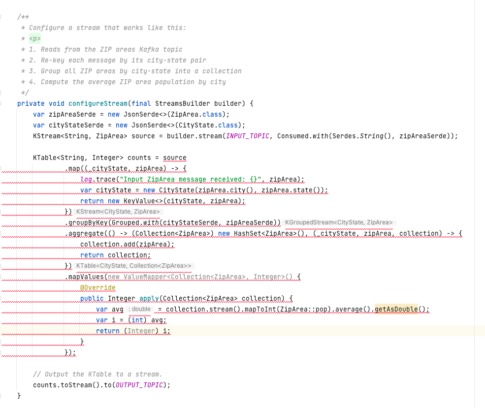
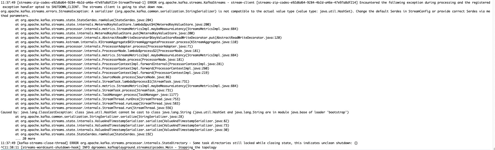
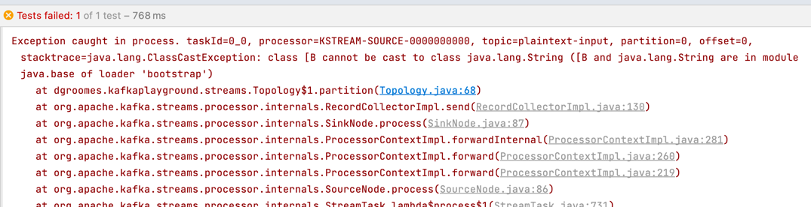

# streams-zip-codes

An intermediate Kafka Streams project that aggregates ZIP code data.

## Description

This is a Kafka Streams re-implementation of the MongoDB example project [*Aggregation with the Zip Code Data Set*](https://docs.mongodb.com/manual/tutorial/aggregation-zip-code-data-set/)
on the MongoDB website. Also, this project is designed after another project of my own in the GitHub repo [dgroomes/mongodb-playground](https://github.com/dgroomes/mongodb-playground/tree/main/incremental)
and specifically the `incremental/` sub-project there.

## Why?

I want to compare and contrast technologies like Kafka Streams with MongoDB when it comes to domain problems that could be
solved by either technology. ZIP code population data is an excellent example domain. It is a familiar concept, the data
is simple and the data is easily available.

## Instructions

1. Use Java 16
1. Install Kafka and `kafkacat`:
    * `brew install kafka`
    * `brew install kafkacat` 
1. Start Kafka
    *  Read [`commands.sh`](#commandssh) and then execute the following command to start the Kafka broker:
    * `startKafka`
1. Create the topics
    * Open a new terminal and create the input, intermediate, and output Kafka topics with the following command:
    * `createTopics`
1. Build and run the program:
    * `build && run`
1. Produce and consume messages
   * In a new terminal, start a consumer process which will eventually receive messages on the output Kafka topic. Use
     the following command:
   * `consumeCityStats`
   * In a new terminal, produce some test data with the following command:
   * `produceSpringfield1`
   * You should see some data in your consumer!
   * Next, produce additional data with the following command and watch the consumer:
   * `produceSpringfield2`
1. Stop all components
    * When you are done, stop the Kafka consumer in the other terminal.
    * Stop the application in the other terminal.
    * Finally, stop the Kafka broker with the following command:
    * `stopKafka`

## `commands.sh`

Source the `commands.sh` file using `source commands.sh` which will load your shell with useful
commands. Commands include: `build`, `startKafka` `run`, `consumeCityStats` etc. See the contents of the file for more.

## Notes

Here is a note on the development experience. Below is a screenshot of my IDE while I was configuring a Kafka Streams
topology using the Kafka Streams DSL. There is red underline across the whole expression because while iterating on the
code, I change the types. For example, I started by aggregating to a count of Long and changed to Integer. It's a bit of
a frustrating experience, but to be fair, consider writing a non-trivial SQL expression. You won't get red underline in
the IDE because SQL is a dynamic language, but you would instead get runtime errors when you go to execute the SQL expression.
So, this boils down to the classic trade-off between strongly typed and dynamically typed languages.

Still, is there a better way? Wht is the idiomatic way to write code using the Kafka Streams DSL? Is it better to decompose
the expression into multiple statements, and assign each statement to a local variable? This way you can see, at-a-glance,
how the types flow from start to finish. Better yet, you can declare the types of the local variables to as a way to "declare
your intent" for the types you want even before you have figured out and learned the exact Kafka Streams DSL code to write
on the righthand of the assignment. For example, if you decompose the topology intro three statements and the first and
last expression are valid code, the middle one might be invalid but at least you'll only get red underline on the middle
statement instead of the whole thing! This is a better feedback loop.

Here is another development experience snippet. This is a runtime error.

Here is another one (actually from the 'streams/' sub-project) that happened when I tried adding the Kafka Streams test utils:

What is `class [B`?

## TODO

* DONE Scaffold a compilable and runnable project
* DONE Get rid of the repartitioning. I only want a baseline benchmark of a single partition. Keep things simple.
* DONE the state store using in Java using the Kafka Streams client. This is more convenient than the Bash script
* DONE Get the Zip code data into the project
* DONE Parse the ZIP area data input message JSON
* DONE Aggregate into avg pop by city
* SKIP (not feasible, i would have to enable SSL and then use ACLs) Disable topic auto creation. I want the explicit feedback that "'xyz' topic does not exist" and I want the app to shut
  down. I do not want the app to log 100+ warn log messages that the the topic does not exist, and then it eventually creates
  the topic automatically.
* DONE (and in fact, Confluence recommends doing it: https://docs.confluent.io/platform/current/streams/developer-guide/dsl-topology-naming.html#changing-names) Is it possible to use explicitly named internal topics instead of the names like 'streams-zip-codes-KSTREAM-AGGREGATE-STATE-STORE-0000000002-repartition'?
  I am already relying on manually created topics and so I have to know the topic names. So it's an opportunity to use meaningfully
  named topics with a word like "rekey" or "aggregate-to-collection" instead of the anonymously named 'streams-zip-codes-KSTREAM-AGGREGATE-STATE-STORE-0000000002-repartition'.
* DONE (This is already implemented because we're using keys) De-duplicate the same ZIP area records
* DONE Compute state-level ZIP area average population
* DONE Compute overall-level ZIP area average population
* DONE Use a KTable for zip area records because they represent a changelog stream and not an event stream. Read the Kafka
  Streams docs on KStreams vs KTable, they are really good.
* DONE Fix ZIP area key. It should be keyed on ZIP code not city

### Wish List

Items I wish to implement for this project:

* DONE (Yeah this is way better) Extract all Kafka Streams DSL operations into their own methods so that it is easier to visually trace the topology
  code. It is easy to get lost in the Java types and the topology edges in the topology graph!
* Are there ways to reduce the sheer quantity of internal topics, like the repartition topics? Is there a way to express
  the topology in such a way that, for example, all zip area records in "MA" (Massachusetts) are sourced from the same
  source topic partition? I know Kafka Streams doesn't know that a ZIP code always stays within the same state, but it's
  true. Can a custom partitioner implementation solve this?
* More tests. Specifically, test same-key updates in the city aggregation without a leading ZIP area. I think we'll get
  the empty scenario that happens in the state aggregation.

## Reference

* [Apache Kafka Streams: *Developer Guide*](https://kafka.apache.org/28/documentation/streams/developer-guide/)
